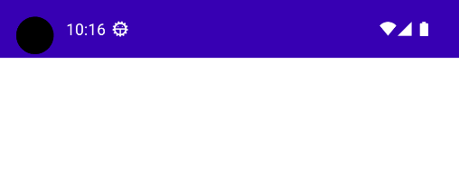

# Head Up Banner library [](https://jitpack.io/#jojoyel/head-up-banner)

## Description

This android library allows you to display any kind of information at the top of the user's screen.
Inspired by Material Design's Snackbar, however, some things changed, it is possible to display an
icon, make the banner clickable and/or closeable.

## Overview

| Name      | Example                                                          |
|-----------|------------------------------------------------------------------|
| Normal    |     |
| Icon      |       |
| Clickable |  |
| Closeable |  |

## Usage example

```kotlin
val displayerState = rememberHeadUpDisplayerState()

HeadUpDisplayer(headUpDisplayerState = displayerState) {
    // Display your content
    NavHost(...) {
    ...
}
}

// Show a Head Up Banner
LaunchedEffect(true) {
    displayerState.headUpBannerHostState.showHeadUpBanner(
        content = { Text(text = "Hi, you can display whatever you want") }
    )
}
```

## Install

The library is deployed with [jitpack](https://jitpack.io/#jojoyel/head-up-banner) and ready to use
in your project, just follow these few steps :

settings.gradle

```gradle
dependencyResolutionManagement {
    ...
    repositories {
        ...
        maven { url 'https://jitpack.io' }       
    }
}
```

build.gradle (app)

```gradle
dependencies {
    implementation 'com.github.jojoyel:head-up-banner:1.0.0'
}
```